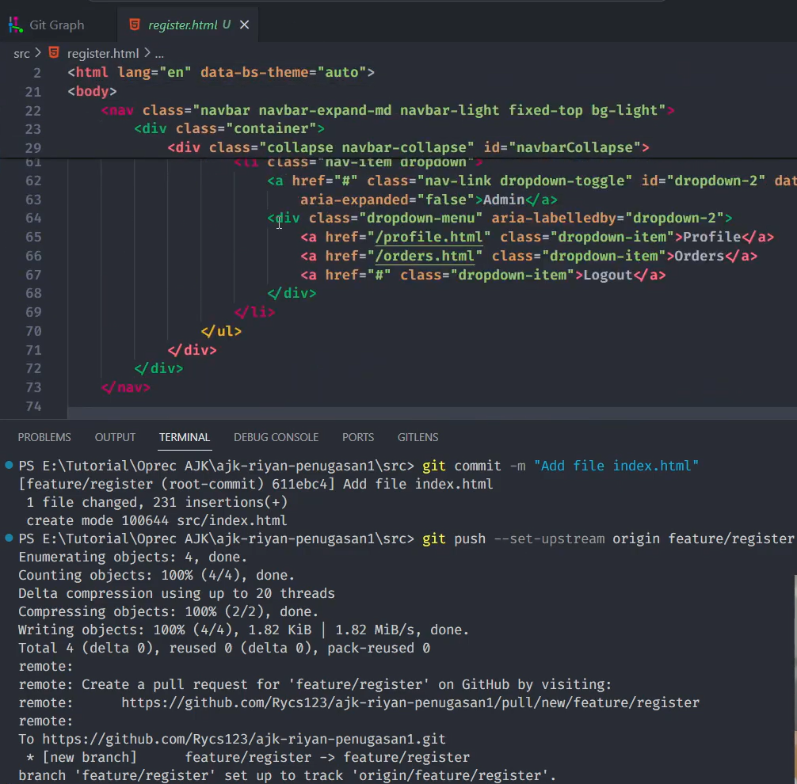
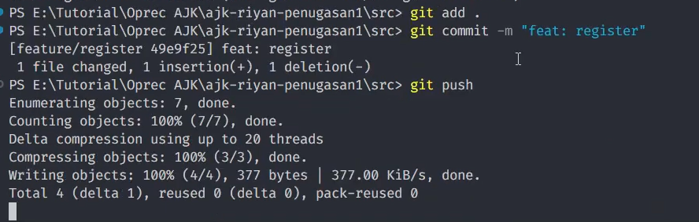

# Level 1

Link YouTube: https://youtu.be/3ClY98oVbQI

Disclaimer: vidio di youtube sudah dibuat sesingkat mungkin jadi bisa saja ada perbedaan command, tetapi tujuannya tetap satu yaitu menyelesaikan level ini

Berikut ini dokumentasi pengerjaan level 1:

## Daftar Pertanyaan

-   [1. Apa yang harus dikerjakan?](#1-apa-yang-harus-dikerjakan)
-   [2. Implementasikan penggunaan branching yang terdiri dari master, development, featureA, dan featureB. Codebase dibebaskan.](#2-implementasikan-penggunaan-branching)
-   [Implementasikan intruksi git untuk push, pull, stash, reset, diff, dan merge. Adanya tambahan intruksi git selain yang disebutkan akan lebih baik.](#3-implementasikan-intruksi-git)
-   [Implementasikan sebuah penanganan conflict di branch development ketika setelah merge dari branch featureA lalu merge dari branch featureB. Catatan: conflict bisa terjadi jika kedua branch mengerjakan di file dan line code yang sama. Buatlah skenario sendiri.](#bermain-di-local-repository)
-   [5. Gunakan merge no fast forward.](#bermain-di-local-repository)

 

### 1. Apa yang harus dikerjakan?

Buat sebuah repository di GitHub. Nama repository dalam format ajk-[nama panggilan]-penugasan1. Repository ini juga sebagai tempat menaruh laporan pengerjaan untuk level selanjutnya.

Contoh: ajk-nur-penugasan1

Struktur:

/src (Berisi kode pengerjaan level 1 kalian)

README.md (Readme utama)

level-1.md (Laporan level 1)

level-2.md (Laporan level 2)

level-3.md (Laporan level 3)

level-4.md (Laporan level 4)

 

#### Langkah-langkah di github

Kunjungi github.com

Klik 'New'

Repository name diisi sesuai format seperti ajk-riyan-penugasan1

Atur ke private, setelah itu klik 'Create repository'

 

#### Langkah-langkah di file explorer

Buat folder di 'working directory'/local folder dan rename sesuai format seperti ajk-riyan-penugasan1

Setelah itu buat file dan folder seperti struktur di bawah ini

Setelah itu buka vs code di directory tersebut

 

### 2. Implementasikan penggunaan branching

 

#### Langkah-langkah di vscode:

Buka terminal vscode (lihat menu 'Terminal' dan pilih 'New Terminal') atau melalui shortcut Ctrl+Shift+~

Ketik 'git init'

Copy remote yang ada di github dan paste ke terminal vscode

 

#### Implementasi ke branch development:

Buat branch development terlebih dahulu dengan cara ketik 'git branch -M development'

Tambahkan semua file bertipe MD dengan cara ketik 'git add \*.md'

Commit file yang sudah diadd ke dalam staging area dengan cara ketik 'git commit -m "initial commit"'

Setelah itu dipush dengan cara ketik 'git push --set-upstream origin development'

Setelah itu, tambahkan file app.css ke dalam staging area dengan cara ketik 'git add .\src\css\app.css'

Dan commit dengan cara ketik 'git commit -m "Add file app"'

Jika ingin mengubah commit terakhir, ketik 'git commit --amend -m "Add file app.css"'

Jika ingin membatalkan commit dan menyimpan perubahan dalam working directory, ketik 'git reset --soft HEAD^'

Pesan yang dicommit akan hilang

Add kembali file app.css seperti sebelumnya

Lalu jika ingin melihat status (apa yang kurang dan apa yang sudah dilakukan), ketik git status

Hanya sebagai ilustrasi saja

Setelah itu commit ulang dengan commit message yang sama dan push

Hanya ilustrasi saja walaupun filenya berbeda

 

#### Implementasi ke branch feature/login:

Ketik 'git checkout --orphan feature/login' untuk membuat branch baru tanpa membawa commit history dari branch manapun

Ketik 'git reset --hard' untuk menghapus file-file yang ada di dalam staging area, untuk menghapus file yang berada di working directory tinggal dihapus manual, lalu add filenya juga secara manual

Setelah itu tambahkan file index.html ke dalam staging area lalu commit dengan cara ketik 'git add .\src\index.html' dan 'git commit -m "Add file index.html"'

Lalu dipush

Lalu tambahkan file login.html ke dalam staging area dan commit menggunakan conventional commit message

Setelah itu push dengan cara ketik 'git push'

Setelah itu perhatikan apakah ada folder/file lain selain index.html dan login.html, jika ada hapus saja karena jika tidak dihapus maka akan ada semacam peringatan untuk menghapus(file/folder tersebut) sebelum switch branch

 

#### Implementasi ke branch feature/register:

Ketik 'git checkout --orphan feature/register' untuk membuat branch baru tanpa membawa commit history dari branch manapun

Ketik 'git reset --hard' untuk menghapus file-file yang ada di dalam staging area, untuk menghapus file yang berada di working directory tinggal dihapus manual, lalu add filenya juga secara manual

Setelah itu tambahkan file index.html ke dalam staging area lalu commit dengan cara ketik 'git add .\src\index.html' dan 'git commit -m "Add file index.html"'

Lalu dipush, dengan cara ketik 'git push --set-upstream origin feature/register'

Lalu tambahkan file register.html ke dalam staging area dan commit menggunakan conventional commit message

Setelah itu push dengan cara ketik 'git push'

Setelah itu perhatikan apakah ada folder/file lain selain index.html dan login.html, jika ada hapus saja karena jika tidak dihapus maka akan ada semacam peringatan untuk menghapus(file/folder tersebut) sebelum switch branch

 

### 3. Implementasikan intruksi git

 

-   git stash

    git stash memiliki banyak manfaat seperti menyimpan perubahan tanpa membuat commit, beralih branch tanpa komit, mengatasi konflik saat pull, dan pembersihan working directory

    contoh penggunaan git stash

    sebelum ketik git stash saya delete suatu script (lebih jelasnya bisa dilihat di gambar)

    

    setelah ketik git stash, apa yang saya delete akan kembali

    

    jadi siapapun dapat berpindah branch untuk melakukan commit atau yang lainnya

    jika ingin kembali, tinggal ketik git stash pop

    

-   git push --force-with-lease

    perintah yang digunakan untuk memaksa push ke remote repository tanpa menghancurkan perubahan yang telah dilakukan oleh kontributor lain. Perintah ini aman digunakan ketika Anda ingin memperbarui remote repository dengan perubahan lokal Anda, tetapi Anda ingin memastikan bahwa Anda tidak menimpa perubahan yang telah ada di remote repository oleh kontributor lain.

### 4.Implementasikan sebuah penanganan conflict di branch development ketika setelah merge dari branch featureA lalu merge dari branch featureB

 

### 5. Gunakan merge no fast forward.
